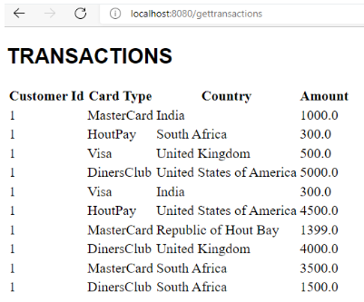
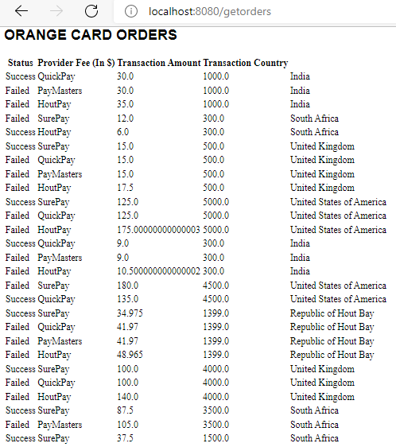
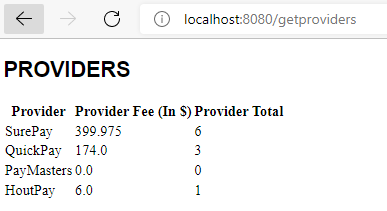
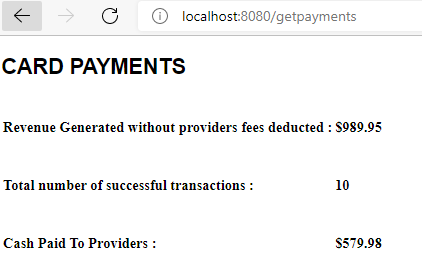

# Orange card payment system

###1. Build and run the Docker image

#### 1.1 Download docker and install docker

#### 1.2 Open the terminal and run the following scripts:
* mvn clean install
* docker login
* docker build -t card-payments -f Dockerfile .
* docker run -p 8080:8080 -t card-payments
* go to the browser and type:
  ** http:\\localhost:8080\gettransactions
  ** http:\\localhost:8080\getproviders
  ** http:\\localhost:8080\getpayments
  ** http:\\localhost:8080\getorders

#### 1.3 Build and run the application in your local  machine

Open the terminal and run the following scripts:

* mvn clean install
* mvn spring-boot:run
  * go to the browser and type:
    ** http:\\localhost:8080\gettransactions
       
    ** http:\\localhost:8080\getorders
       
    ** http:\\localhost:8080\getproviders
       
    ** http:\\localhost:8080\getpayments
       
    

