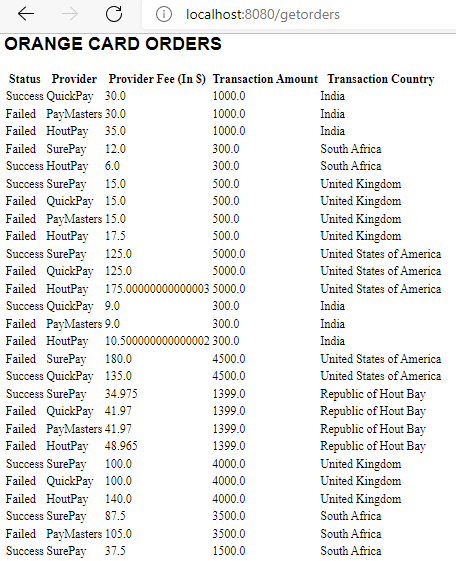

# Orange card payment system

### 1. Build and run the Docker image

#### 1.1 Download docker and install docker

#### 1.2 Open the terminal and run the following scripts:
* mvn clean install
* docker login
* docker build -t card-payments -f Dockerfile .
* docker run -p 8080:8080 -t card-payments
* Go to the browser and type:
  * http:\\localhost:8080\gettransactions
  * http:\\localhost:8080\getproviders
  * http:\\localhost:8080\getpayments
  * http:\\localhost:8080\getorders

#### 1.3 Build and run the application in your local  machine

Open the terminal and run the following scripts:

* mvn clean install
* mvn spring-boot:run
* Go to the browser and type:
  * http:\\localhost:8080\gettransactions
  * http:\\localhost:8080\getproviders
  * http:\\localhost:8080\getpayments
  * http:\\localhost:8080\getorders

#### 1.4 Application Functionality   

* Functionality 1 : Each transactions is processed by the providers that  will charge for the transaction
  * 
  
  * 

* Functionality 2 : Keep track of the total value and transactions by each Orange Payments

  *     
    

* Functionality 3 : Keep track of the total value and transactions by each provider

  * 

  
    

